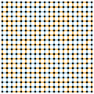

# Viznet

A visualization tool for atoms (based on Compose.jl).

Warning: still under development...

[](https://travis-ci.com/GiggleLiu/Viznet.jl)
[](https://codecov.io/gh/GiggleLiu/Viznet.jl)

## To start

To install, type `]` in a Julia REPL and then

```julia pkg
pkg> add https://github.com/GiggleLiu/Viznet.jl
```

As a first example, open a Julia REPL and type

```julia
using Viznet
using Compose

# define you atoms/lattice
ud = rand_unitdisk(20, 2.0)

# set the line brush and node brush
linebrush = compose(context(), bondstyle(:default), stroke("black"))
nodebrush = nodestyle(:default)

# draw something on the canvas
canvas() do
    for i in vertices(ud)
        nodebrush >> ud[i]
    end
    for (i, j) in bonds(ud)
        linebrush >> ud[i;j]
    end
end |> SVG("_unitdisk.svg")
```

To learn more about customizing styles, please go to the documentation of [Compose.jl](http://giovineitalia.github.io/Compose.jl/latest/).

## Gallery
##### [Spin glass](examples/spinglass.jl)



##### [Unit Disk Graph](examples/unit_disk_graph.jl)


## Styles
Document eaten by a blackhole.
